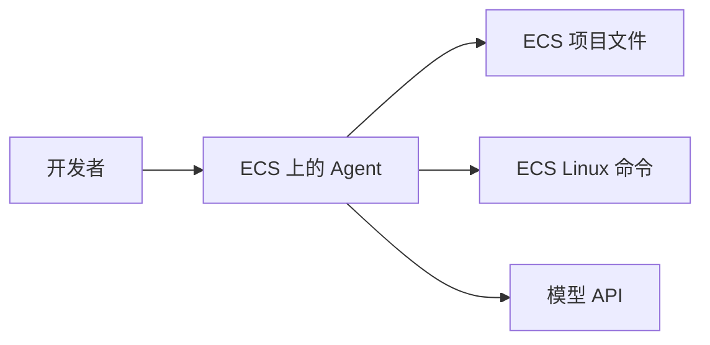
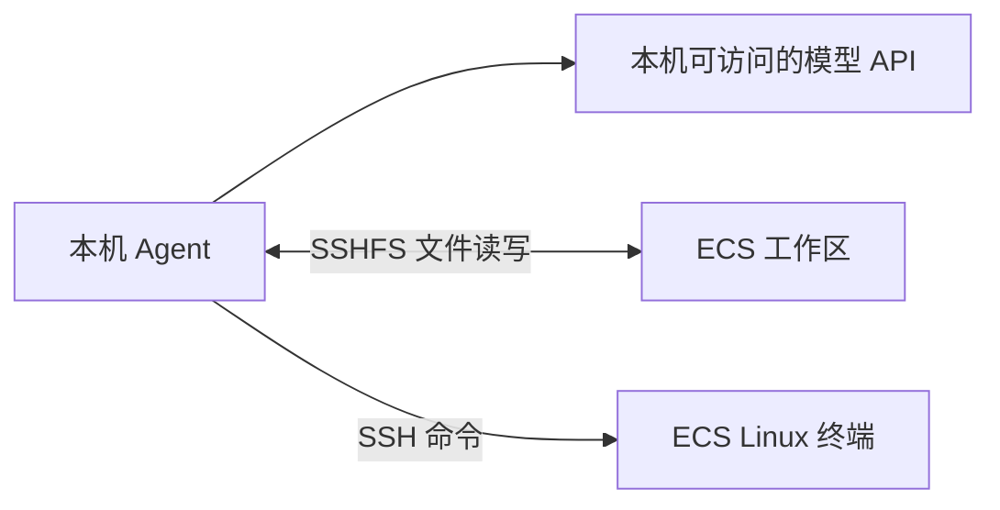

# 云端实战：CC与Codex的设计哲学差异
因为面试官要求学习一下ai coding在云服务器上的应用，我又重拾起这个之前被我抛弃的问题，开了一台阿里云 ECS，进行了一些尝试，到最后甚至发现了一些CC和Codex底层上的设计差异，感觉会有些朋友刚刚接触有相同的问题，所以写一篇文章作为记录

## 先说结论：有两种架构

### 远程 Agent

Claude Code、Codex CLI 或其他 Agent 直接安装在 ECS 上，然后直接云服务器的命令行里面使用指令对话就可以。

Codex 官方自带的 SSH 功能可以理解成远程运行：桌面应用通过 SSH 启动远程端的 Codex 组件，远程主机需要安装 CLI，并能在登录 shell 中找到 `codex`。至于模型请求从哪里发出，要看具体实现和配置，不能只凭“SSH 已连接”下结论。

这时 Agent 能直接读写服务器文件、安装依赖和运行测试，非常方便。

但是有两个问题，一个是配置问题，这个就是我最早遇到的问题，也是第一次放弃的原因之一，因为国内用不了CC，所以希望换成国内大模型API，然后去下载了CCswitch,但是CCswitch必须有GUI界面才能使用。

其实也不算什么大问题，但是当时的想法是如果只是为了这个去整个GUI有点太麻烦，所以搁置了wwwwwww。

不过这个问题有个相对简单的解决方式。以 CC 为例，可以在一台已经配置好的电脑里打开 CCSwitch，查看当前生效的 `settings.json`，再把确认适用于远程环境的配置复制到服务器。不要盲目覆盖全部内容，因为里面可能有本机路径、插件配置或凭据。

然后还有一个的话就是可能存在的多人协作问题。

把这个方案画出来，其实就是 Agent、代码、命令和 API 都在 ECS：



## 本地Agent

这里我大概做了两种尝试

### 本地 Agent + 远程工作区


如果只想对文件进行改动的话，可以使用SSHFS将云服务器内容映射到本机作为一个盘来使用，本地Agent也能够对文件进行修改。

模型请求从本机发出，因此 ECS 不必访问模型 API。这个方案的关键是：
SSHFS 只提供文件通道，不会自动提供远程命令执行能力。

这也是被pass的一个原因www，面试官问我这样的话Agent怎么执行命令。

一句话我直接冒冷汗。

本机 Agent 的结构则反过来：模型请求留在本机，ECS 提供文件和运行环境。



### 本地Agent直接运行SSH命令

最开始的思路是，让本机 Agent 调用本机的 SSH 客户端。只要本机已经配置好免密登录，Agent 就可以执行类似这样的命令：

```powershell
ssh coder@xxx.xxx.xxx.xxx "cd /home/coder/workspace && ls -la"
```

这里的 PowerShell 命令是在本机启动的，但引号里的 `ls -la` 会在 ECS 上执行。测试、安装依赖、启动服务也可以用同样的方式完成：

```powershell
ssh my-ecs "cd /home/coder/workspace && npm test"
```

我实际验证时，CC 通过本机 Bash 调用了 SSH，成功返回了 ECS 的主机名、登录用户和根目录列表。到这里，面试官问的“Agent 怎么执行 Linux 命令”就有了一个清楚的答案：Agent 不需要安装在云服务器上，它可以调用本机 SSH 客户端，把命令交给远程主机执行。

但我一开始用的是 Codex，所以中间又绕了一点弯路。OpenSSH 会检查私钥文件的访问权限，避免其他系统用户读取身份凭据；而我使用的 Codex 命令工具运行在独立的沙箱环境里，不能直接读取 Windows 用户的 `.ssh` 目录。

即使把私钥复制到工作区，也可能遇到读取权限或 `UNPROTECTED PRIVATE KEY FILE` 错误。前者是沙箱账户无法访问文件，后者是 OpenSSH 认为私钥权限过宽；这是两个不同层次的问题。

CC用这个没什么问题，因为CC使用的就是你的Windows用户。

当然最后发现其实Codex也很简单，让Codex以自己身份创建一个私钥就能进行访问。。。突然感觉之前的努力都有点白费了，不过过程中学到了不少东西

## Codex 与 Claude Code 的运行边界

这里不打算比较哪个 Agent 更强，而是想把一个很容易混淆的问题说清楚：Agent 到底运行在哪里。

OpenAI 把 Codex CLI 定义成运行在本地终端里的 coding agent，它能读取、修改和运行代码；本地 CLI、IDE 扩展和桌面工作流，与委托到云端的 Codex Cloud 是不同的运行环境。[Codex CLI Getting Started](https://help.openai.com/en/articles/11096431) [Using Codex with your ChatGPT plan](https://help.openai.com/en/articles/11369540-using-codex-with-your-chatgpt-plan)

Claude Code 也是同样的逻辑。它的 CLI 可以增加可访问目录，也可以用 `--allowedTools` 和 `--disallowedTools` 控制哪些工具能自动执行。[Claude Code CLI reference](https://docs.anthropic.com/en/docs/claude-code/cli-usage) 这些参数控制的是 Agent 的权限边界，不会改变 Agent 的运行位置。

所以，打开了远程文件夹，不代表 Agent 就在远程运行；在本机打开了一个窗口，也不代表所有扩展都在本机运行。VS Code Remote SSH 会在远端安装 VS Code Server，部分扩展会跟着远程 Extension Host 一起运行。[Remote Development overview](https://code.visualstudio.com/docs/remote/remote-overview)

我现在判断这类问题会看四件事：文件从哪里读写，命令在哪台机器执行，模型请求从哪里发出，权限由哪个用户提供。只要这四个问题都能回答清楚，架构就不会靠猜。

另外，所谓“沙箱”也不是一个模糊的安全标签。云端任务通常运行在隔离容器里，网络、文件和凭据都有单独边界；本机 Agent 能访问的 SSH 密钥，不会因为同一个账号登录就自动出现在云端任务里。[GPT-5 Codex System Card](https://cdn.openai.com/pdf/97cc5669-7a25-4e63-b15f-5fd5bdc4d149/gpt-5-codex-system-card.pdf)

这也解释了我前面遇到的现象：CC 能调用本机 SSH，是因为它继承了我的 Windows 用户和 SSH 配置；当前 Codex 不能直接读取同一份私钥，是因为它运行在另一个沙箱用户里。不是 Agent 的能力不同，而是它们拿到的文件和权限不同。

## SSH 不只是“连上服务器”

SSH 免密登录这个说法容易让人误会。它不是没有认证，而是把认证从“输入密码”换成了“本机私钥证明身份”：远端用户的 `~/.ssh/authorized_keys` 保存公钥，OpenSSH 服务端验证签名后才允许登录。[sshd(8)](https://man.openbsd.org/sshd)

第一次连接时看到的指纹提示也很重要。客户端会把确认过的服务器主机密钥写入 `known_hosts`；以后如果同一个地址的主机密钥突然变化，SSH 会发出警告，这正是防止中间人攻击的一道检查。[ssh(1)](https://man.openbsd.org/ssh)

私钥则必须反过来保护。权限太宽时，OpenSSH 会报 `UNPROTECTED PRIVATE KEY FILE` 并拒绝使用。这是客户端在阻止其他用户读取你的身份凭据。[ssh(1)](https://man.openbsd.org/ssh)
